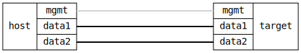

=== LLDP IEEE Group Forward
==== Description
Verify that LLDP packets can be flooded to all ports on a bridge.
Operation and non-operation are confirmed using tcpdump.

==== Topology
ifdef::topdoc[]
image::{topdoc}../../test/case/infix_services/lldp/lldp_ieee_group_forward/topology.svg[LLDP IEEE Group Forward topology]
endif::topdoc[]
ifndef::topdoc[]
ifdef::testgroup[]
image::lldp/lldp_ieee_group_forward/topology.svg[LLDP IEEE Group Forward topology]
endif::testgroup[]
ifndef::testgroup[]

endif::testgroup[]
endif::topdoc[]
==== Test sequence
. Set up topology and attach to target DUT
. Configure interfaces and disable LLDP daemon
. Verify LLDP absence on host:data2
. Enable LLDP flooding by setting group forward
. Verify LLDP arrival on host:data2

<<<

