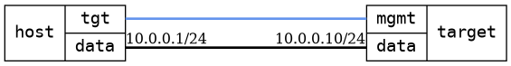

=== Services basic
==== Description
Verify that basic services like mDNS and LLDP can be enabled and
disabled.  We verify operation and non-operation by using tcpdump.

==== Topology
ifdef::topdoc[]
image::../../test/case/infix_services/services_basic/topology.png[Services basic topology]
endif::topdoc[]
ifndef::topdoc[]
ifdef::testgroup[]
image::services_basic/topology.png[Services basic topology]
endif::testgroup[]
ifndef::testgroup[]

endif::testgroup[]
endif::topdoc[]
==== Test sequence
. Initialize
. Set static IPv4 address and disable services
. Start sniffer and enable services on target ...
. Disable services on target, verify no longer running ...

<<<

