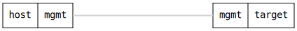

ifdef::topdoc[:imagesdir: {topdoc}../../test/case/infix_services/ssh/ssh_key_authentication]

=== Generate ssh key pair
==== Description
Verify that 'guest' user can fetch data using only the 'public' key

==== Topology

==== Sequence
. Connect to the target device
. Create a guest user on the target device
. Wait until SSH server is ready to accept connections
. Write private key to a temporary file
. Verify it is possible to fetch syslog data using public key

