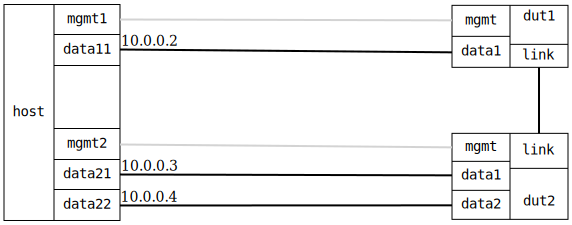

=== Bridge forwarding dual DUTs

ifdef::topdoc[:imagesdir: {topdoc}../../test/case/interfaces/bridge_fwd_dual_dut]

==== Description

Ping through two bridges on two different DUTs.

....

   .-------------------------.       .-------------------------.
   | [ DUT1 ]           link |       | link        [ DUT2 ]    |
   |               br0  -----|-------|-----  br0               |
   |                /        |       |      /   \              |
   | mgmt       data1        |       |  data1   data2     mgmt |
   '-------------------------'       '-------------------------'
       |          |                       |      |          |
       |          |                       |      |          |
.---------------------------------------------------------------.
|   mgmt1      data11                 data21  data22      mgmt2 |
|              [10.0.0.2]         [10.0.0.3]  [10.0.0.4]        |
|              (ns11)                 (ns20)  (ns21)            |
|                                                               |
|                           [ HOST ]                            |
'---------------------------------------------------------------'

....

==== Topology

==== Sequence

. Set up topology and attach to target DUT
. Configure a bridge with triple physical port
. Verify ping 10.0.0.3 and 10.0.0.4 from host:data11

