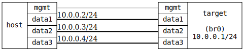

=== IGMP Basic

ifdef::topdoc[:imagesdir: {topdoc}../../test/case/interfaces/igmp_basic]

==== Description

Verify basic IGMP snooping behavior on a bridge.  Without any IGMP
membership, multicast should be flooded to all ports.  Once a host
joins a group, the bridge should learn the membership via IGMP and
only forward matching multicast to the member port, pruning it from
non-member ports.

....
              .1
 .---------------------------.
 |            DUT            |
 '-data1-----data2-----data3-'
     |         |         |
     |         |         |      10.0.0.0/24
     |         |         |
 .-data1-. .-data2-. .-data3-.
 | msend | | mrecv | | !memb |
 '-------' '-------' '-------'
    .2         .3        .4
             HOST
....

A multicast sender on `msend` sends to group 224.1.1.1.  First, with
no IGMP joins, verify the group is flooded to both `mrecv` and `!memb`.
Then `mrecv` joins the group and the test waits for the bridge MDB to
reflect the membership before verifying that `!memb` no longer receives
the group.

==== Topology

==== Sequence

. Set up topology and attach to target DUTs
. Configure device
. Start multicast sender on host:data0, group 224.1.1.1
. Verify that the group 224.1.1.1 is flooded on host:data2 and host:data3
. Join multicast group 224.1.1.1 on host:data2
. Verify group 224.1.1.1 is received on host:data2
. Verify that the group 224.1.1.1 is no longer received on host:data3

