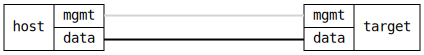

=== ARP and Neighbor Cache

ifdef::topdoc[:imagesdir: {topdoc}../../test/case/interfaces/neighbor_cache]

==== Description

Verify that static ARP entries (IPv4) and neighbor cache entries (IPv6)
can be configured on an interface and are immediately visible in the
operational datastore with origin "static".  Also verify that removing
the entries causes them to disappear from the operational datastore.

==== Topology

==== Sequence

. Set up topology and attach to target DUT
. Configure static IPv4 ARP and IPv6 neighbor entries on target:data
. Verify static IPv4 ARP entry is visible in operational state
. Verify static IPv6 neighbor entry is visible in operational state
. Remove static neighbor entries by clearing IPv4 and IPv6 config
. Verify static neighbor entries are no longer present

