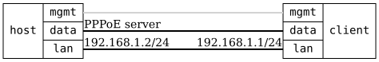

=== PPPoE Client

ifdef::topdoc[:imagesdir: {topdoc}../../test/case/interfaces/pppoe_client]

==== Description

Verify that a PPPoE client session comes up and is used, against a
minimal PPPoE server on the host.

The client authenticates with PAP and gets its IPv4 address and a DNS
server from the server.  Its default route through the session must be
a static route with the configured route preference, the same as a
DHCP route.

A host on the LAN behind the client must reach the server over the
session, which needs the IPv4 forwarding configured on the PPP
interface.  The MSS of its TCP connections to the server must arrive
clamped to the session MTU.

The PPP interface must exist, with its description set, before the
session is up.  When the server drops the session the interface must
stay, without the session's address and route, and the client must come
back on its own when the server returns, this time with CHAP.
Disabling the PPP interface must end the session but keep the interface,
and enabling it again must bring the session back.  With a wrong
password the session must not come up.  Deleting the PPP interface must
remove it.

==== Topology

==== Sequence

. Set up topology and attach to target DUT
. Configure PPPoE client on wan, on top of the data port
. Verify wan exists and is configured before the session is up
. Verify session comes up with PAP, wan gets {PEER}
. Verify default route via wan is static with preference 5
. Verify DNS server {DNS} from the server is used
. Verify IPv4 forwarding is enabled on wan
. Verify LAN host reaches server {SERVER} over the session
. Verify TCP MSS from the LAN is clamped to {CLAMPED_MSS}
. Stop server, verify wan stays without session and default route
. Restart server with CHAP, verify the client reconnects
. Disable wan, verify the session ends and wan stays
. Enable wan, verify the session comes back
. Change password to a wrong one, verify the session stays down
. Delete wan, verify the interface is removed

