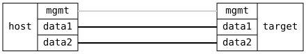

=== QoS DSCP Classification and Remarking End to End

ifdef::topdoc[:imagesdir: {topdoc}../../test/case/interfaces/qos_classify_dscp]

==== Description

Send IP packets with different DSCP values into a routed port that trusts
DSCP with the ietf preset, and route them out over a VLAN interface whose
egress PCP is derived from the internal priority.  The PCP on the wire
then reveals the priority the classifier assigned:

    DSCP  0 (CS0)  -> priority 0
    DSCP  8 (CS1)  -> priority 1
    DSCP 18 (AF21) -> priority 2
    DSCP 26 (AF31) -> priority 3
    DSCP 34 (AF41) -> priority 4
    DSCP 46 (EF)   -> priority 5
    DSCP 48 (CS6)  -> priority 6
    DSCP 56 (CS7)  -> priority 7
    DSCP  4        -> priority 0, not in the preset, port default

Then enable DSCP remarking on the egress port and repeat: every packet
must leave with the class selector of its priority, CS0 to CS7, e.g. EF
in, CS5 out.

Works on any port: classification and remarking run in the switch fabric
where the driver supports them and in the kernel otherwise, and routed
traffic passes the kernel in both cases.

==== Topology

==== Sequence

. Set up topology and attach to target DUT
. Configure routed ingress port trusting DSCP and VLAN egress from priority
. Set up host namespaces on both sides
. Send ICMP echo with DSCP {dscp}, {what} {prio}
. Verify the PCP of each echo request matches its DSCP class
. Enable DSCP remarking from priority on the egress port
. Verify each echo request leaves with the class selector of its priority

