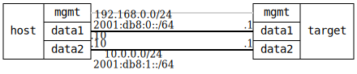

=== Routing basic

ifdef::topdoc[:imagesdir: {topdoc}../../test/case/interfaces/routing_basic]

==== Description

Verify that the ietf-ip forwarding setting controls whether IPv4
and IPv6 traffic is routed between interfaces.  When forwarding is
enabled, hosts on separate subnets can reach each other through
the device.  When forwarding is disabled, that connectivity is
expected to be lost.

==== Topology

==== Sequence

. Set up topology and attach to target DUTs
. Set up host addresses and default routes
. Enable forwarding on target:data1 and target:data2
. Verify cross-subnet IPv4 connectivity
. Verify cross-subnet IPv6 connectivity
. Disable forwarding on target:data1 and target:data2
. Verify cross-subnet connectivity is lost

