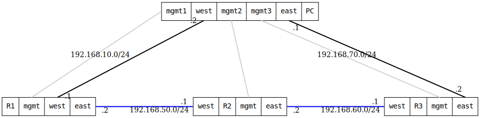

=== VXLAN Tunnel TTL verification

ifdef::topdoc[:imagesdir: {topdoc}../../test/case/interfaces/tunnel_ttl]

==== Description

Verify that GRE and VXLAN tunnels use a fixed TTL (default 64) for
encapsulated frames instead of inheriting the TTL from inner packets.
Critical for protocols like OSPF that use TTL=1 for their packets.

The test setup creates a tunnel between R1 and R3 so that injecting
a frame with TTL=3 from PC:west, routing it through the tunnel, it
would still reach PC:east.  (Had it been routed via R2 it would be too
many hops and the TTL would reach zero before the last routing step.)

    PC:west -- R1 -- R2 -- R3 -- PC:east
               `== Tunnel =='

==== Topology

==== Sequence

. Set up topology and attach to target DUTs
. Configure R1 with vxlan tunnel to R3
. Configure R2 as intermediate router (underlay forwarding)
. Configure R3 with vxlan tunnel to R1
. Send ping from PC:west to PC:east with low TTL
. Verify packets arrived at PC:east

