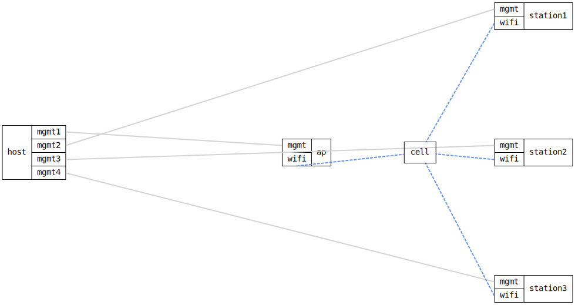

=== WiFi Access Point serving three Stations

ifdef::topdoc[:imagesdir: {topdoc}../../test/case/interfaces/wifi_ap_multi_station]

==== Description

One AP and three Stations, each on its own DUT: the ap runs a
WPA2/WPA3-personal Access Point on radio0, and station1, station2 and
station3 each associate to it.  The radios are in separate kernels, so the
"air" between them is realised differently per environment:

  * On real hardware the links are real RF -- the stations just associate.
  * On QEMU the radios are mac80211_hwsim, and the `wifimedium` relay on each
    DUT bridges hwsim frames over the Ethernet segments between the guests
    (the topology's wifi-links).  See doc/wifi.md.

This is the multi-client case: a single AP cell must serve more than one
station at once.  Each station associating with WPA2/WPA3-personal is a
strong end-to-end check -- authentication, association and the WPA 4-way
handshake all require frames to cross the medium in *both* directions -- so
three successful associations prove the AP keeps several stations
associated simultaneously over the (relayed) radio links.  It then confirms
data-plane reach: the ap serves DHCP and each station leases an address
from the pool over the radio link.

Topology:
....
                       ((( station1 ==(mgmt)== host
    host ==(mgmt)== ap ((( station2 ==(mgmt)== host
                       ((( station3 ==(mgmt)== host
....

==== Topology

==== Sequence

. Set up topology and attach to the ap and three stations
. Configure the ap as an Access Point on radio0
. Configure the station on radio0
. Verify the station associates to the ap over the wifi link
. Verify the station's wifi0 operational status is up
. Verify the station leases an address from the ap over wifi

