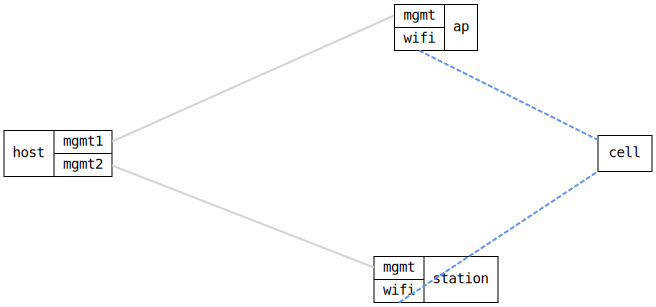

=== WiFi AP and Station Association across two DUTs

ifdef::topdoc[:imagesdir: {topdoc}../../test/case/interfaces/wifi_ap_station_2dut]

==== Description

Two DUTs, each with its own radio: the ap runs a WPA2/WPA3-personal Access
Point, the station associates to it.  The radios are in
separate kernels, so the "air" between them is realised differently per
environment:

  * On real hardware the link is real RF -- the radios just associate.
  * On QEMU the radios are mac80211_hwsim, and the `wifimedium` relay on
    each DUT bridges hwsim frames over the Ethernet segment between the
    guests (the topology's wifi-link).  See doc/wifi.md.

The test asserts that the station associates with WPA2/WPA3-personal.  That
is a strong end-to-end check: authentication, association and the WPA
4-way handshake all require frames to cross the medium in *both*
directions, so a successful association proves real bidirectional
communication over the (relayed) radio link -- not just that an interface
came up.  It then confirms data-plane reach: the ap serves DHCP and the
station leases its address over the radio link.

Topology:
....
    host ==(mgmt)== ap  )))  ~ wifi-link ~  ((( station ==(mgmt)== host
....

==== Topology

==== Sequence

. Set up topology and attach to the ap and the station
. Configure the ap as an Access Point on radio0
. Configure the station on radio0
. Verify the station associates to the ap over the wifi link
. Verify the station's wifi0 operational status is up
. Verify the station leases its address from the ap over wifi

