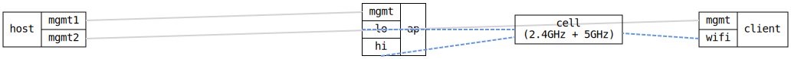

=== WiFi Band Steering across a dual-band Access Point

ifdef::topdoc[:imagesdir: {topdoc}../../test/case/interfaces/wifi_band_steering]

==== Description

One DUT is a dual-band Access Point whose two radios sit on the *same*
wireless cell: one radio serves the SSID "campus" on 2.4GHz and the other
serves the same SSID on 5GHz.  Both BSSes are bridged into br0 with a single DHCP
server, so the two bands are one network.  Infix runs all AP radios in a
single hostapd process, which is what lets the cross-radio band-steering
directive resolve (see src/confd/src/hardware.c).

The other DUT is a client with a *single* dual-band radio.  Because both
BSSes share one cell, that one radio hears "campus" on both bands -- the
device band steering acts on.

Enabling 802.11v (`roaming dot11v`) on both BSSes turns on MBO band steering
by default: hostapd tracks which band it has seen a client on and, on the
2.4GHz BSS, suppresses probe responses to a client it has seen on the 5GHz
BSS (`no_probe_resp_if_seen_on`).  A dual-band client is therefore answered
only on 5GHz and associates there; a 2.4-only client, never seen on 5GHz, is
still answered and works normally.  See doc/wifi.md.

The test asserts the client associates to "campus", that band steering lands
it on the 5GHz BSS (not the 2.4GHz one), and that it leases an address -- a
completed association plus DHCP lease is real bidirectional traffic over the
(relayed) radio link.

Topology:
....
                       (( 2.4GHz ))
    host ==(mgmt)== ap            ~ one cell ~  client ==(mgmt)== host
                       ((  5GHz  ))         (single dual-band radio)
....

==== Topology

==== Sequence

. Set up topology and attach to the ap and the client
. Configure the dual-band AP: one BSS on 2.4GHz, one on 5GHz
. Configure the client with a single dual-band station radio
. Verify the client associates to the 'campus' SSID
. Verify band steering put the client on the 5GHz BSS
. Verify the client leases an address over 5GHz

