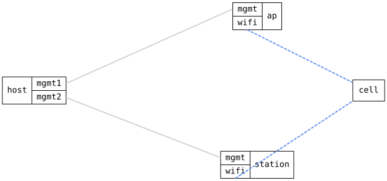

=== WiFi channel survey on a connected radio

ifdef::topdoc[:imagesdir: {topdoc}../../test/case/interfaces/wifi_channel_survey]

==== Description

A channel survey tells how busy each channel is.  Collecting it means
leaving the operating channel, so it is not done in the background but
on request, with the channel-survey action on the radio.  The action has
to work on a radio that is in use: here on the ap, which is serving a
station, and on the station, which is associated to the ap.

Topology:
....
    host ==(mgmt)== ap  )))  ~ cell ~  ((( station ==(mgmt)== host
....

==== Topology

==== Sequence

. Set up topology and attach to the ap and the station
. Configure the ap as an Access Point on channel 1 and the station on radio0
. Verify the station associates to the ap over the wifi link
. Run a channel survey on radio0 of the station
. Verify the station's survey reports 2412 MHz as the channel in use
. Verify the station's survey covers more channels than the one in use
. Run a channel survey on radio0 of the ap
. Verify the ap's survey reports 2412 MHz as the channel in use
. Verify the station is still associated to the ap after the surveys

