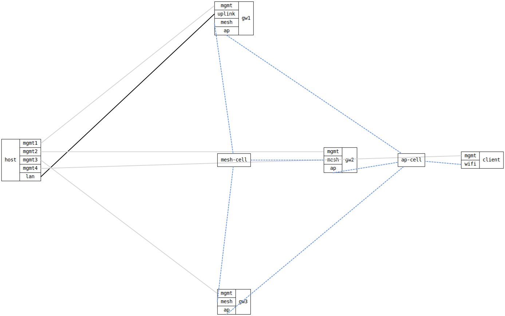

=== WiFi Mesh backhaul with roaming Access Points

ifdef::topdoc[:imagesdir: {topdoc}../../test/case/interfaces/wifi_mesh_roaming]

==== Description

The worked example from doc/whitepaper-wifi-mesh-roaming.md, as a test.

Three gateway nodes (gw1, gw2, gw3) each do two jobs on two radios:

  * radio0 -- an 802.11s mesh point.  The three join one mesh ("backhaul")
    on 5GHz; this carries traffic between the nodes.
  * radio1 -- a WPA2/WPA3-personal Access Point on 2.4GHz.  All three share
    the same SSID ("campus") and 802.11r mobility domain, so a client roams
    between them as one network.

Each node bridges its mesh and AP into br0, so the mesh is a transparent
layer-2 backhaul.  A fourth node is the client.

The test checks the claims the whitepaper makes:

  1. the three nodes form a mesh (each sees its two peers);
  2. the client associates to the "campus" SSID;
  3. roaming: the client reports the BSSID it is connected to, which is one
     of the three gw APs; when that AP is taken down the client moves to
     another node -- same SSID, same mobility domain -- so the reported
     BSSID changes to a different gw.

In simulation every radio hears every other at one fixed strength, so there
is no signal gradient to drift the client between APs.  Step 3 forces the
move instead, which is a stronger check: it proves a second AP accepts the
client.

Topology:
....
    gw1 (mesh+AP) ))  ~ mesh ~  (( gw2 (mesh+AP)
        \                        /
         )  ~ mesh ~  (( gw3 (mesh+AP)
          client (((roams between the gw APs)))
....

==== Topology

==== Sequence

. Set up topology and attach to gw1, gw2, gw3 and the client
. Configure gw1, gw2, gw3 as mesh nodes with a roaming AP
. Configure the client as a station for the 'campus' SSID
. Verify the three nodes form the mesh backhaul
. Verify the client associates to the 'campus' SSID
. Verify the client is connected to one of the campus APs
. Take down the client's current AP to force a roam
. Verify the client roams to another node's AP

