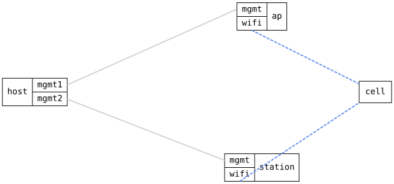

=== WiFi station set up from a scan-only interface

ifdef::topdoc[:imagesdir: {topdoc}../../test/case/interfaces/wifi_station_from_scan]

==== Description

A WiFi interface with only a radio, no station or access point, is in
scan-only mode.  That is how the factory configuration of boards with a
built-in radio ships, so the usual way to get online is to add the station
settings to that existing interface.  The connection has to come up from
that change alone, without a reboot or a service restart.

Topology:
....
    host ==(mgmt)== ap  )))  ~ cell ~  ((( station ==(mgmt)== host
....

==== Topology

==== Sequence

. Set up topology and attach to the ap and the station
. Configure the ap with access point 'infix-scan' and a DHCP server on 192.168.21.1
. Configure wifi0 on the station with only radio0, scan-only mode
. Verify the station sees 'infix-scan' in its scan results
. Add station settings for 'infix-scan' to wifi0 on the station
. Verify the station associates to 'infix-scan' without a restart
. Verify the station leases 192.168.21.100 over wifi

