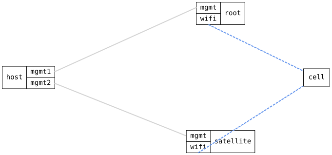

=== WiFi 4-address (WDS) link between two bridges

ifdef::topdoc[:imagesdir: {topdoc}../../test/case/interfaces/wifi_wds_link_2dut]

==== Description

Two DUTs: the root runs an access point with a WDS port, the satellite a
4-address station.  Both ends are bridge ports, so the radio link joins
the two bridges at layer 2.

On the root, wds0 is created by configuration before any station shows up
and gets its VLAN membership like any other bridge port.  The access point
binds the station with the configured MAC address to it: the port comes up
when the station associates and goes down, but stays, when it leaves.  On
the satellite, the station is a bridge port, which needs 4-address mode.

The DHCP lease over the link is the data-plane check: the request and the
reply cross both bridges and the radio in opposite directions.

Topology:
....
    host ==(mgmt)== root  )))  ~ cell ~  ((( satellite ==(mgmt)== host
    br0/vlan10 -- wds0 ~~~~~~~~~~~~~~~~~~~~~~ wifi0 -- br0
....

==== Topology

==== Sequence

. Set up topology and attach to the root and the satellite
. Configure the root with access point 'infix-wds' and WDS port wds0 untagged in VLAN 10 on br0
. Verify wds0 on the root exists, is down and is an untagged member of VLAN 10
. Configure the satellite with a 4-address station for 'infix-wds' in br0, br0 as DHCP client
. Verify the satellite's wifi0 associates to 'infix-wds'
. Verify wds0 on the root comes up and reports the station connected
. Verify the satellite leases 192.168.20.100 on br0 over the WDS link
. Disable wifi0 on the satellite
. Verify wds0 on the root goes down but remains a member of VLAN 10
. Enable wifi0 on the satellite again
. Verify wds0 on the root comes up again

