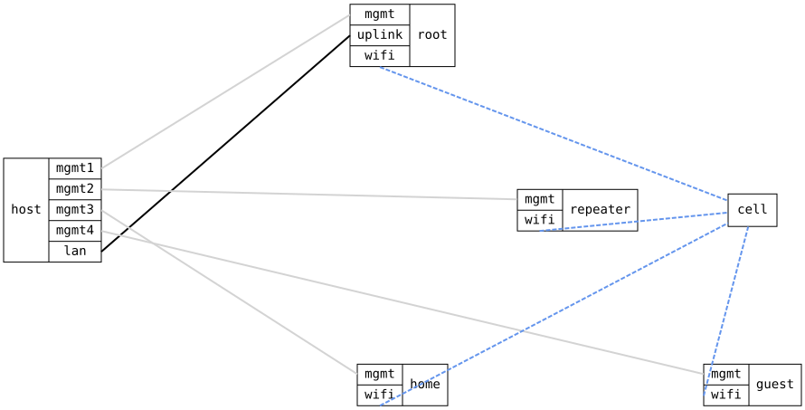

=== WiFi repeater over a 4-address (WDS) backhaul

ifdef::topdoc[:imagesdir: {topdoc}../../test/case/interfaces/wifi_wds_repeater]

==== Description

Three DUTs.  The root runs the backhaul access point 'infix-backhaul' with
a WDS port bridged to its wired uplink.  The repeater has a 4-address
station on that backhaul, bridged with its own access point 'infix-client'
on the same radio.  The client is a plain station on 'infix-client'.

Only the repeater advertises 'infix-client', so the client can land
nowhere else; the test still checks the BSSID it reports.  Reaching the
client from the host behind the root is what only 4-address frames can
do: the client's own MAC address has to cross the backhaul in both
directions inside the station's frames.

Taking the backhaul down and up again shows it is a transparent bridge
port: the client loses and regains reach without re-associating.

Topology:
....
    host ==(lan)== root (AP 'infix-backhaul')
                    wds0 )))  ~ cell ~  ((( wifi0 repeater wifi1 (AP 'infix-client')
                                                             )))  ~ cell ~  ((( client
....

==== Topology

==== Sequence

. Set up topology and attach to the root, the repeater and the client
. Configure the root with access point 'infix-backhaul' and WDS port wds0 bridged with the uplink
. Configure the repeater with a 4-address station for 'infix-backhaul' bridged with access point 'infix-client'
. Configure the client as a station for 'infix-client' with address 10.0.0.9
. Verify the repeater's wifi0 associates to 'infix-backhaul'
. Verify wds0 on the root is up
. Verify the client associates to 'infix-client'
. Verify the client is on the repeater's access point, BSSID 02:00:00:00:0a:02
. Verify the host behind the root reaches the client at 10.0.0.9 through the repeater
. Disable the repeater's backhaul station wifi0
. Verify the client at 10.0.0.9 is no longer reachable from the host
. Enable the repeater's backhaul station wifi0 again
. Verify the host reaches the client at 10.0.0.9 again
. Verify the client is still on BSSID 02:00:00:00:0a:02

