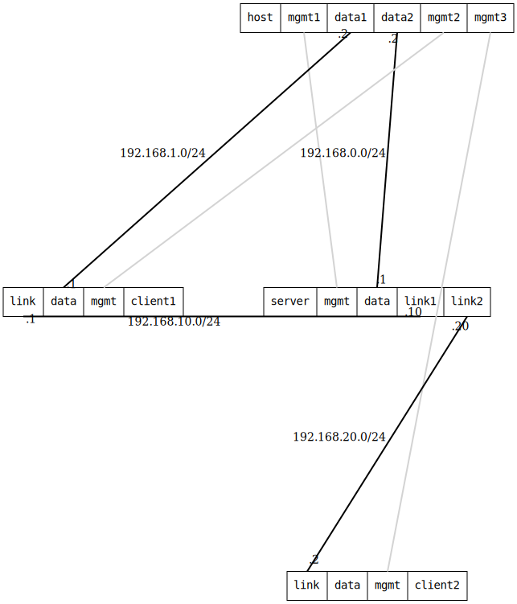

=== WireGuard multipoint

ifdef::topdoc[:imagesdir: {topdoc}../../test/case/interfaces/wireguard_multipoint]

==== Description

Set up a WireGuard hub-and-spoke topology with one server (hub) and two
clients (spokes). The server acts as a central point through which clients
can communicate. Host namespaces are connected behind the server and client1
to test routing through the WireGuard mesh.

This test verifies:

- WireGuard hub-and-spoke topology with multiple peers
- Mixed IPv4/IPv6 tunnel endpoints (client1 uses IPv4, client2 uses IPv6)
- Dual-stack WireGuard tunnels carrying both IPv4 and IPv6 traffic
- Advanced key management with preshared keys for post-quantum resistance
- Persistent keepalive configuration for NAT traversal
- Different listen ports on server and clients
- Multiple allowed-ips per peer for routing multiple subnets
- Static routes for subnet reachability through WireGuard
- Security boundaries enforced by allowed-ips (client2 isolated from server subnet)
- IPv4 and IPv6 connectivity through the encrypted tunnel mesh
- Proper routing between all nodes in the WireGuard network

WireGuard hub-and-spoke:
....
                    server:wg0 (10.0.0.1, fd00:0::1)
                                 |
                +----------------+----------------+
                |                                 |
         client1:wg0                        client2:wg0
      (10.0.0.2, fd00:0::2)              (10.0.0.3, fd00:0::3)
      via IPv4 endpoint                  via IPv6 endpoint
      192.168.10.x                       2001:db8:3c4d:20::x
....

Security boundaries:
- host:data1 can reach all WireGuard IPs (10.0.0.1, .2, .3 and fd00:0::1, ::2, ::3)
- host:data2 can reach server and client1 WireGuard IPs, but NOT client2 (blocked by allowed-ips)

==== Topology

==== Sequence

. Set up topology and attach to target DUTs
. Configure server, client1 and client2
. Verify IPv4 connectivity with ping 10.0.0.1, 10.0.0.2 and 10.0.0.3 from host:data1
. Verify IPv4 connectivity with ping 10.0.0.1 and 10.0.0.2 from host:data2
. Verify host:data2 can not ping 10.0.0.3
. Verify IPv6 connectivity with ping fd00:0::1, fd00:0::2 and fd00:0::3 from host:data1
. Verify IPv6 connectivity with ping fd00:0:1 and fd00:0:2 from host:data2
. Verify host:data2 can not ping fd00:0::3

