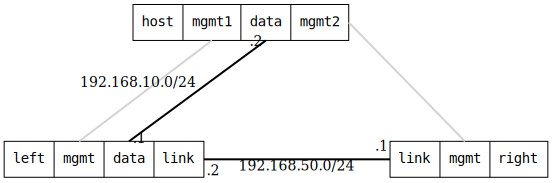

=== WireGuard Point-to-Point

ifdef::topdoc[:imagesdir: {topdoc}../../test/case/interfaces/wireguard_p2p]

==== Description

Set up a WireGuard tunnel between two DUTs with a host connected to the first
DUT. Enable IP forwarding on first DUT's interface to host and the WireGuard
tunnel interface to the second DUT. On host, add route to IP network of second
DUT and verify connectivity with the second DUT through the WireGuard tunnel.

This test verifies:

- WireGuard tunnel establishment between two peers
- Key management via ietf-keystore with X25519 keypairs
- IPv4 and IPv6 connectivity through the encrypted tunnel
- Proper routing through the WireGuard tunnel

Topology:
....
                     192.168.50.0/24
    host:data ---- left:data   left:link ---- right:link
 192.168.10.2/24  192.168.10.1  192.168.50.1   192.168.50.2
                                      \\              /
                                       \\            /
                                        \\  WireGuard
                                         \\ Tunnel  /
                                          \\      /
                                   left:wg0    right:wg0
                                 10.0.0.1/32  10.0.0.2/32

....

==== Topology

==== Sequence

. Set up topology and attach to target DUTs
. Configure WireGuard tunnel on DUTs
. Verify IPv4 connectivity with ping 10.0.0.2 from host:data
. Verify IPv6 connectivity with ping fd00::2 from host:data

