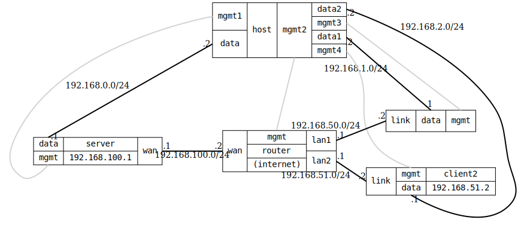

=== WireGuard Roadwarrior

ifdef::topdoc[:imagesdir: {topdoc}../../test/case/interfaces/wireguard_roadwarrior]

==== Description

This test demonstrates a realistic roadwarrior scenario where clients
connect through an internet router to reach a VPN server.

Set up a WireGuard server with 2 roadwarrior clients connecting through
a router that simulates the internet. Each client is on a different subnet
behind the router, and has a private network that should be accessible
through the VPN tunnel.

This test verifies:

- WireGuard tunnel establishment through an intermediate router
- Roadwarrior clients on different subnets
- Access to server's private network through the VPN tunnel
- Routing between client networks and server network via WireGuard

Topology:
....
    Server ---- Router ---- Client1
    (VPN)    (Internet)     \---- Client2

    WAN: 192.168.100.0/24
    Server: 192.168.100.1
    Router: 192.168.100.2

    Client1 link: 192.168.50.0/24 (Router LAN1)
    Client2 link: 192.168.51.0/24 (Router LAN2)

    WireGuard tunnel: 10.0.0.0/24
    Server: 10.0.0.1/24
    Client1: 10.0.0.2/24
    Client2: 10.0.0.3/24

    Backend networks:
    Server data: 192.168.0.0/24
    Client1 data: 192.168.1.0/24
    Client2 data: 192.168.2.0/24
....

==== Topology

==== Sequence

. Set up topology and attach to target DUTs
. Configure DUTs
. Check on the server that both clients is connected
. Verify IPv4 connectivity with ping 192.168.0.2 from host:data1 and host:data2

