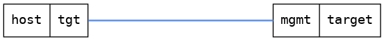

=== Undefined
==== Description
Undefined

==== Topology
ifdef::topdoc[]
image::/home/lazzer/Documents/addiva/infix/test/case/misc/start_from_startup/topology.png[Undefined topology]

endif::topdoc[]
ifndef::topdoc[]
ifdef::testgroup[]
image::lazzer/Documents/addiva/infix/test/case/misc/start_from_startup/topology.png[Undefined topology]

endif::testgroup[]
ifndef::testgroup[]

endif::testgroup[]
endif::topdoc[]
==== Test sequence
. Initialize
. Configure
. Reboot and wait for the unit to come back
. Verify hostname

<<<

