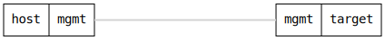

=== Support data collection

ifdef::topdoc[:imagesdir: {topdoc}../../test/case/misc/support_collect]

==== Description

Verify that the support collect command works and produces a valid tarball
with expected content.

==== Topology

==== Sequence

. Set up topology and attach to target DUT
. Run support collect with short log tail (2 seconds)
. Verify tarball was created and is valid

