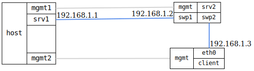

=== NTP client stratum selection

ifdef::topdoc[:imagesdir: {topdoc}../../test/case/ntp/client_stratum_selection]

==== Description

Verify NTP client properly selects between multiple servers based on
stratum level.

This test validates NTP clock selection algorithm by configuring a client
to sync from two servers with different stratum levels:

- srv1: Test PC running BusyBox ntpd (stratum ~1 via -l flag)
- srv2: NTP server DUT syncing from srv1 (stratum ~2)
- client: NTP client DUT syncing from both servers

Both servers sync to the same time source (srv2 syncs from srv1),
ensuring time agreement and avoiding the "falseticker" problem. The client
should then select srv1 (lower stratum) as its sync source.

==== Topology

==== Sequence

. Set up topology and attach to devices
. Configure srv2 to sync from srv1 and serve with higher stratum
. Wait for srv2 to sync from srv1
. Configure client to sync from both servers
. Wait for client to see both servers
. Verify client selects srv1 (lower stratum)

