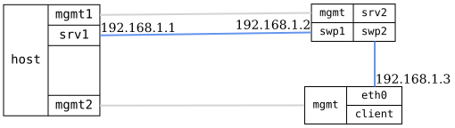

=== NTP Client Stratum Selection

ifdef::topdoc[:imagesdir: {topdoc}../../test/case/ntp/client_stratum_selection]

==== Description

Verify NTP client properly selects between multiple servers based on
stratum level.

This test validates NTP clock selection algorithm by configuring a client
to sync from two servers with different stratum levels:

- srv1: Test PC running BusyBox ntpd, serving its local clock (-l)
- srv2: NTP server DUT syncing from srv1 (one stratum higher)
- client: NTP client DUT syncing from both servers

Both servers sync to the same time source (srv2 syncs from srv1),
ensuring time agreement and avoiding the "falseticker" problem. The client
should then select srv1 (lower stratum) as its sync source.

NOTE: srv1 serves the test PC's system clock, so the test depends on that
clock being stable for the duration of the run.  A host time daemon that
applies discrete corrections, e.g. systemd-timesyncd, makes the client
flag srv1 as unstable and refuse to select it.  Test PCs should keep the
clock free-running during the test, or discipline it with a slewing
daemon such as chronyd.

==== Topology

==== Sequence

. Set up topology and attach to devices
. Configure srv2 to sync from srv1 and serve with higher stratum
. Wait for srv2 to sync from srv1
. Configure client to sync from both servers
. Wait for client to see both servers
. Wait for srv2 stratum to stabilize
. Verify client selects srv1 (lower stratum)

