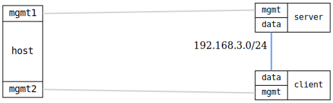

=== NTP server and client interoperability

ifdef::topdoc[:imagesdir: {topdoc}../../test/case/ntp/server_client]

==== Description

Verify NTP server and client work together:

1. Server uses ietf-ntp YANG model with refclock-master
2. Client uses ietf-system YANG model
3. Client successfully synchronizes from server
4. Server shows packet statistics
5. Mutual exclusion prevents both modes on same device

==== Topology

==== Sequence

. Set up topology and attach to devices
. Configure NTP server using ietf-ntp model
. Configure NTP client using ietf-system:ntp model
. Verify NTP server has received packets
. Verify NTP client has synchronized

