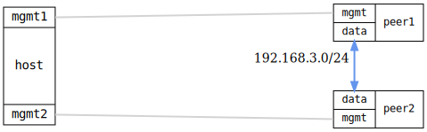

=== NTP peer mode

ifdef::topdoc[:imagesdir: {topdoc}../../test/case/ntp/server_mode_peer]

==== Description

Verify NTP server operating in peer mode with bidirectional
synchronization.

This test validates peer mode where two NTP servers synchronize with
each other bidirectionally. Each server acts as both client and server
to the other:

- peer1: Stratum 8 local clock, peered with peer2
- peer2: Stratum 8 local clock, peered with peer1

The test verifies mutual synchronization and clock selection between
peers.  When both peers have the same stratum, NTP's clock selection
algorithm uses the Reference ID (derived from the IP address) as its
tie-breaker.  The peer with the numerically lower IP address will be
selected as sync source by the other peer.

==== Topology

==== Sequence

. Set up topology and attach to devices
. Configure DUTs with bidirectional peer relationships
. Verify peers see each other in associations
. Verify peers can reach each other
. Wait for one peer to select the other as sync source

