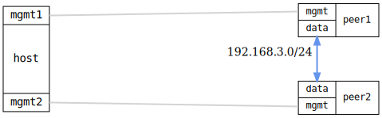

=== NTP peer mode

ifdef::topdoc[:imagesdir: {topdoc}../../test/case/ntp/server_mode_peer]

==== Description

Verify NTP server operating in peer mode with bidirectional synchronization.

This test validates peer mode where two NTP servers synchronize with each other
bidirectionally. Each server acts as both client and server to the other:
- peer1: Stratum 8 local clock, peered with peer2
- peer2: Stratum 8 local clock, peered with peer1

The test verifies mutual synchronization between peers.

==== Topology

==== Sequence

. Set up topology and attach to devices
. Configure peer1 with peer relationship to peer2
. Configure peer2 with peer relationship to peer1
. Verify peer1 sees peer2 in sources
. Verify peer2 sees peer1 in sources
. Verify peer1 can reach peer2
. Verify peer2 can reach peer1

