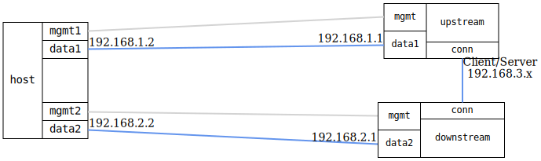

=== NTP server mode

ifdef::topdoc[:imagesdir: {topdoc}../../test/case/ntp/server_mode_server]

==== Description

Verify NTP server operating in server mode, syncing from upstream while
serving clients.

This test validates server mode where devices synchronize from upstream
NTP servers while simultaneously serving time to downstream clients. It
creates a two-tier hierarchy:

- Upstream: NTP server with local reference clock (stratum 8)
- Downstream: NTP server that syncs from upstream and serves to clients (stratum 9)

The test verifies both servers operate correctly and serve accurate time.

==== Topology

==== Sequence

. Set up topology and attach to devices
. Configure upstream NTP server with local reference clock
. Configure downstream NTP server syncing from upstream
. Verify network connectivity with upstream NTP server
. Query time from upstream NTP server
. Verify upstream NTP server statistics
. Verify network connectivity with downstream NTP server
. Wait for downstream to sync from upstream
. Verify downstream NTP server statistics

