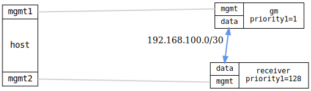

=== PTP basic (IEEE 1588)

ifdef::topdoc[:imagesdir: {topdoc}../../test/case/ptp/basic]

==== Description

Verify basic PTP operation end-to-end: clock configuration, port state
transitions, and clock servo convergence.

Two Ordinary Clocks are connected back-to-back.  The grandmaster is
configured with `priority1=1` so it always wins the BTCA election; the
time receiver is configured with `time-receiver-only` so it never
attempts to become grandmaster.  The test is run once per supported
profile, covering both IEEE 1588-2019 (UDP/IPv4, E2E) and IEEE 802.1AS
(Layer 2, P2P).

==== Topology

==== Sequence

. Set up topology and attach to DUTs
. Configure grandmaster (OC, ieee1588, priority1=1) and time receiver (ieee1588, priority1=128, client-only)
. Wait for grandmaster and time receiver ports to reach active states
. Wait for time receiver offset to converge

