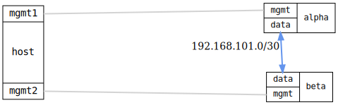

=== PTP BTCA grandmaster election (IEEE 802.1AS)

ifdef::topdoc[:imagesdir: {topdoc}../../test/case/ptp/bmca]

==== Description

Verify that the Best TimeTransmitter Clock Algorithm (BTCA) selects the clock
with the lowest `priority1` as grandmaster, and that a change of `priority1`
at runtime triggers a new election with the correct result.

Two Ordinary Clocks are connected back-to-back.  Both announce themselves as
potential grandmasters.  In round one, *alpha* holds `priority1=1` and wins
the election; *beta* (`priority1=128`) becomes the time receiver.  In round
two, *alpha* is reconfigured to priority1=200 without restarting; the BTCA
re-runs and beta wins, becoming the new grandmaster.  The test verifies that
alpha's `parent-ds` `grandmaster-identity` changes to beta's `clock-identity`,
confirming that the re-election is reflected in the operational datastore.

Announce intervals are reduced to 250 ms (`log-announce-interval -2`) and the
announce receipt timeout to 2 intervals (500 ms) to make re-election complete
in roughly one second rather than the default three.

The test is run for both IEEE 1588-2019 (UDP/IPv4, E2E) and IEEE 802.1AS
(Layer 2, P2P) profiles.

==== Topology

==== Sequence

. Set up topology and attach to DUTs
. Configure both DUTs (ieee802-dot1as); alpha has lower priority1
. Verify initial election: alpha is grandmaster, beta is time receiver
. Reconfigure alpha with worse priority1=200
. Verify beta wins re-election (is own grandmaster)
. Verify alpha tracks beta as grandmaster

