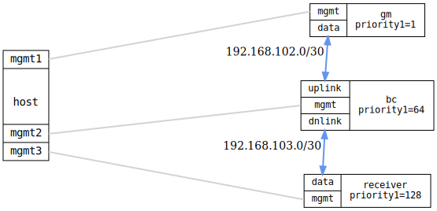

=== PTP boundary clock (IEEE 802.1AS)

ifdef::topdoc[:imagesdir: {topdoc}../../test/case/ptp/boundary_clock]

==== Description

Verify that a Boundary Clock (BC) correctly receives time on one port and
distributes it on another, and that the downstream time receiver sees exactly
one additional hop (`steps-removed=2`).

Three nodes are connected in a chain: a grandmaster Ordinary Clock (OC,
`priority1=1`), a Boundary Clock (BC, `priority1=64`) with two ports, and a
time-receiver Ordinary Clock (OC, `priority1=128`).

The BC's upstream port (toward the GM) must reach time-receiver state; the
downstream port (toward the time receiver) must reach time-transmitter state.
The time receiver's `steps-removed` counter must equal 2: the BC increments
`steps-removed` to 1 in the ANNOUNCE messages it forwards, and the time
receiver adds 1 more when it stores the value in its `currentDS`.  An OC
directly connected to the GM shows 1, so the BC adds exactly one extra hop.

The test is run for both IEEE 1588-2019 (UDP/IPv4, E2E) and IEEE 802.1AS
(Layer 2, P2P) profiles.

==== Topology

==== Sequence

. Set up topology and attach to DUTs
. Configure grandmaster (OC, ieee802-dot1as, priority1=1) and boundary clock (BC, ieee802-dot1as, priority1=64, two ports)
. Wait for BC uplink port to become time-receiver
. Wait for BC dnlink port to become time-transmitter
. Wait for boundary clock offset to converge
. Configure time receiver (OC, ieee802-dot1as, priority1=128, client-only)
. Wait for time receiver to reach time-receiver state
. Verify time receiver steps-removed equals 2 (one BC hop)
. Wait for time receiver offset to converge

