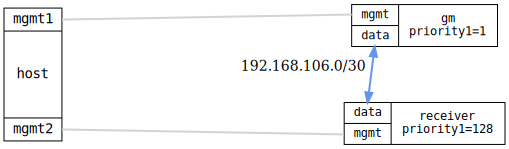

=== PTP port fault recovery

ifdef::topdoc[:imagesdir: {topdoc}../../test/case/ptp/port_recovery]

==== Description

Verify that the PTP port state machine correctly detects a link fault
and recovers to time-receiver state once the link is restored.

Two Ordinary Clocks are connected back-to-back.  Once the time receiver
has converged, the grandmaster's data interface is disabled.  The time
receiver must leave time-receiver state within a short timeout.  When
the interface is re-enabled, the time receiver must return to
time-receiver state and its offset must converge again to within the
configured threshold.

==== Topology

==== Sequence

. Set up topology and attach to DUTs
. Configure grandmaster (priority1=1) and time receiver (client-only)
. Wait for initial convergence
. Disable grandmaster data interface to trigger fault
. Verify time receiver leaves time-receiver state
. Re-enable grandmaster data interface
. Wait for time receiver to return to time-receiver state after recovery
. Wait for offset to re-converge

