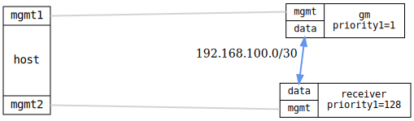

=== PTP servo step-threshold

ifdef::topdoc[:imagesdir: {topdoc}../../test/case/ptp/servo]

==== Description

Verify that configuring a non-zero `step-threshold` allows the clock servo
to correct a large time offset by stepping rather than slewing.

Two Ordinary Clocks are connected back-to-back using the IEEE 1588 profile.
After initial convergence the receiver is reconfigured with
`step-threshold=1.0 s` and ptp4l restarts.  Because the offset at restart
is near zero, `first_step_threshold` (ptp4l's per-startup step gate) does
not trigger, so the restart itself is convergence-neutral.

Once the receiver has re-locked, the grandmaster clock is stepped forward by
10 seconds using phc_ctl (hardware PHC) or the system clock (software
timestamping).  The 10-second offset exceeds the 1-second step-threshold, so
the servo steps the clock immediately and the receiver converges within a
few seconds.

Note: a negative test (verify that offset=10 s does *not* converge without
step-threshold) is not included here because it is unreliable across
platforms.  On physical hardware the kernel caps clock frequency adjustment
at ~500 ppm, making a 10-second slew take ~5.5 hours; on virtual clocks
(QEMU) no such limit applies and the servo can slew the offset away in
seconds.  Full negative coverage requires exposing first_step_threshold and
max_frequency in the YANG model — see TODO.org.

==== Topology

==== Sequence

. Set up topology and attach to DUTs
. Configure grandmaster (OC, IEEE 1588, priority1=1) and time receiver
. Wait for grandmaster and time receiver ports to reach active states
. Wait for initial convergence
. Reconfigure receiver with step-threshold=1.0 s
. Inject {STEP_SEC}-second offset on grandmaster clock
. Verify receiver converges by stepping (step-threshold=1.0 s)

