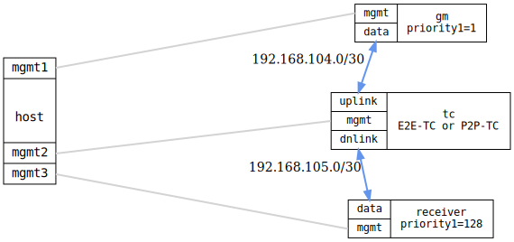

=== PTP transparent clock (IEEE 802.1AS)

ifdef::topdoc[:imagesdir: {topdoc}../../test/case/ptp/transparent_clock]

==== Description

Verify that an E2E or P2P Transparent Clock (TC) passes timing transparently
through a hardware switch without adding a boundary-clock hop, and that the
downstream time receiver converges to the grandmaster's time.

Three nodes are connected in a chain: a grandmaster Ordinary Clock
(`priority1=1`), a Transparent Clock, and a time-receiver Ordinary Clock
(`priority1=128`).

The TC updates the correction field in each Sync and Delay_Req message to
account for its own residence time.  Because a TC is transparent, the time
receiver's `steps-removed` counter must equal 1 — unlike a Boundary Clock,
which would give 2.  A TC passes ANNOUNCE messages unchanged (`stepsRemoved=0`
from the GM), and the time receiver adds 1 when it stores the value in
`currentDS`, giving a total of 1.  A BC increments `stepsRemoved` to 1 before
forwarding, and the receiver adds 1 more, giving 2.  The time receiver's offset must converge within the configured threshold
(default is tighter when the topology provides hardware timestamping links).

The delay mechanism (E2E or P2P) is controlled by the test suite for
IEEE 1588 runs.  When the profile is IEEE 802.1AS the delay mechanism is
always P2P (mandated by the standard) and Layer 2 transport is used.

==== Topology

==== Sequence

. Set up topology and attach to DUTs
. Configure grandmaster (OC, priority1=1, {dm})
. Configure transparent clock ({dm}-tc, ieee802-dot1as)
. Configure time receiver (OC, priority1=128, client-only)
. Wait for grandmaster port to become time-transmitter
. Wait for time receiver to reach time-receiver state
. Verify time receiver steps-removed equals 1
. Wait for time receiver offset to converge

