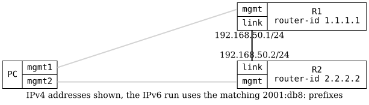

=== OSPFv3 Auto-Cost Reference Bandwidth

ifdef::topdoc[:imagesdir: {topdoc}../../test/case/routing/ospf_auto_cost]

==== Description

Verifies that the OSPFv3 interface cost follows the configured auto-cost
reference bandwidth.  The reference bandwidth must be the same on all
routers in an OSPF domain, so it is changed on both R1 and R2.

The cost of an interface is the reference bandwidth divided by the link
speed, with 1 as the lowest cost.  A link of unknown speed, e.g., a virtual
link, counts as 10000 Mbit/s.  On a 1 Gbit/s link the cost is:

|===
| Reference bandwidth      | Cost
| 100000 Mbit/s (default)  | 100
| 10000 Mbit/s             | 10
| 1000 Mbit/s              | 1
|===

The test reads the link speed on each router to calculate the expected
cost, and reads the reference bandwidth back from the operational
datastore.

==== Topology

==== Sequence

. Set up topology and attach to target DUTs
. Configure OSPFv3 on R1 and R2
. Wait for OSPFv3 adjacency between R1 and R2
. Verify default reference bandwidth 100000 Mbit/s and link cost
. Set reference bandwidth 10000 Mbit/s on R1 and R2
. Verify reference bandwidth 10000 Mbit/s and link cost
. Set reference bandwidth 1000 Mbit/s on R1 and R2
. Verify reference bandwidth 1000 Mbit/s and link cost

