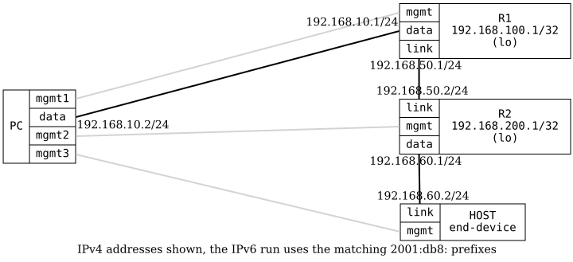

=== OSPFv2 Basic

ifdef::topdoc[:imagesdir: {topdoc}../../test/case/routing/ospf_basic]

==== Description

Verifies basic OSPFv2 functionality by configuring two routers (R1 and R2)
with OSPFv2 on their interconnecting link.  The test ensures OSPFv2
neighbors are established, routes are exchanged between the routers, and
end-to-end connectivity is achieved.

An end-device (HOST) is connected to R2 on an interface without OSPFv2
enabled.  This verifies that OSPFv2 status information remains accessible
when a router has non-OSPFv2 interfaces.

Note: OSPFv3 has no IPv4 address to derive a router-id from, so an
explicit-router-id is configured when running OSPFv3.

==== Topology

==== Sequence

. Set up topology and attach to target DUTs
. Configure targets
. Wait for OSPFv2 routes
. Verify R2 OSPFv2 neighbors with non-OSPFv2 interface
. Test connectivity from PC:data to R2 loopback

