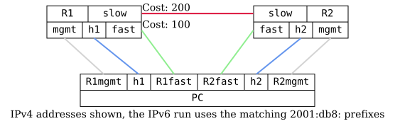

=== OSPFv2 BFD

ifdef::topdoc[:imagesdir: {topdoc}../../test/case/routing/ospf_bfd]

==== Description

Verify that a router running OSPFv2, with Bidirectional Forwarding
Detection (BFD) enabled, will detect link faults even when the
physical layer is still operational.

This can typically happen when one logical link, from OSPF's
perspective, is made up of multiple physical links containing media
converters without link fault forwarding.

Note: OSPFv3 next-hops are IPv6 link-local addresses, so the active path is
verified with traceroute rather than by matching a RIB next-hop, and its BFD
peers are only known by their session count.

==== Topology

==== Sequence

. Set up topology and attach to target DUTs
. Setup TPMR between R1fast and R2fast
. Configure R1 and R2
. Setup IP addresses and default routes on h1 and h2
. Wait for R1 and R2 to peer
. Wait for BFD sessions on the fast and slow links to come up
. Verify connectivity from PC:src to PC:dst via fast link
. Disable forwarding between R1fast and R2fast to trigger fail-over
. Wait for OSPF to fail over to the slow link, once the fast link is no longer qualified by BFD
. Verify connectivity from PC:src to PC:dst via slow link

