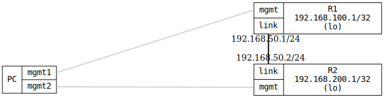

=== OSPF Debug Logging

ifdef::topdoc[:imagesdir: {topdoc}../../test/case/routing/ospf_debug]

==== Description

Verifies OSPF debug logging by configuring two routers (R1 and R2) with
OSPF on their interconnecting link. The test enables specific OSPF debug
categories and verifies that appropriate debug messages appear in
/var/log/debug.

This test specifically validates:
- Debug messages appear when debug options are enabled
- No excessive debug messages when debug options are disabled
- Individual categories (ism, nsm, packet) can be toggled independently

==== Topology

==== Sequence

. Set up topology and attach to target DUTs
. Clean up old log files from previous test runs
. Configure R1 and R2 without debug enabled
. Wait for OSPF adjacency to form
. Enable OSPF debug logging on R1
. Verify OSPF debug messages appear in log file
. Remove log file before disabling debug
. Disable OSPF debug logging on R1
. Verify no OSPF debug messages when disabled

