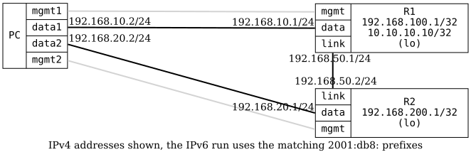

=== OSPFv3 Default Route Advertise

ifdef::topdoc[:imagesdir: {topdoc}../../test/case/routing/ospf_default_route_advertise]

==== Description

Verify _default-route-advertising_ in OSPFv3, sometimes called 'redistribute
origin'.  Verify both 'always' (regardless of whether a local default route
exists) and the conditional mode (only redistribute when a local default route
exists).

R1 has a default route via its data interface and enables
default-route-advertise, so R2 learns a default route via OSPFv3.  When
R1:data is taken down the local default is withdrawn and R2 loses the default
route, unless 'always' is set.
....
 +-------------------+      Area 0            +------------------+
 |       R1          |.1  192.168.50.0/24   .2|      R2          |
 | 192.169.100.1/32  +------------------------+  192.168.200.1/32|
 | 10.10.10.10/32    |R1:link         R2:link |                  |
 +--------------+----+                        +---+--------------+
        R1:data |.1                       R2:data |.1
                |                                 |
                | 192.168.10.0/24                 | 192.168.20.0/24
                |                                 |
    host:data1  |.2                    host:data2 |.2
          +-----+---------------------------------+-------+
          |                                               |
          |             host                              |
          |                                               |
          +-----------------------------------------------+
....
The OSPFv3 run uses the same topology with 2001:db8:10::/64,
2001:db8:20::/64 and 2001:db8:50::/64 respectively.

==== Topology

==== Sequence

. Set up topology and attach to target DUTs
. Configure targets
. Verify R1 has an active static default route
. Wait for all neighbors to peer
. Verify R2 has a default route and R1's loopback from OSPFv3
. Verify connectivity from PC:data2 to R1's dummy interface
. Disable link PC:data1 <--> R1:data (take default gateway down)
. Verify R2 loses the default route but keeps R1's loopback from OSPFv3
. Verify no connectivity from PC:data2 to R1's dummy interface
. Enable redistribute default route 'always' on R1
. Wait for all neighbors to peer
. Verify R2 has a default route and R1's loopback from OSPFv3
. Verify connectivity from PC:data2 to R1's dummy interface

