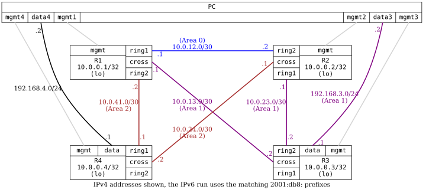

=== OSPFv2 with Multiple Areas

ifdef::topdoc[:imagesdir: {topdoc}../../test/case/routing/ospf_multiarea]

==== Description

This test evaluates various OSPFv2 features across three areas (one NSSA
area) to ensure that route distribution is deterministic (based on cost).  It
also tests link failures using BFD, though BFD is not yet implemented in test
framework (Infamy).

This test also verifies broadcast and point-to-point interface types on the
transit links, and explicit router-id.

OSPFv2 runs the NSSA area as totally-NSSA (summary false), so R3 must see a
default route and none of the area 0 networks.  OSPFv3 has no totally-NSSA, so
there R3 is expected to learn the same networks as inter-area summaries.

....
  +-------------+  +---------------+  +-------------+  +---------------+
  |     R1      |  |      R2       |  |     R3      |  |      R4       |
  | 10.0.0.1/32 |  |  10.0.0.2/32  |  | 10.0.0.3/32 |  |  10.0.0.4/32  |
  |   (lo)      |  |  11.0.9.1/24  |  |   (lo)      |  |      (lo)     |
  +-------------+  |  11.0.10.1/24 |  +-------------+   +---------------+
                   |  11.0.11.1/24 |
                   |  11.0.12.1/24 |
                   |  11.0.13.1/24 |
                   |  11.0.14.1/24 |
                   |  11.0.15.1/24 |
                   |      (lo)     |
                   +---------------+
....

==== Topology

==== Sequence

. Set up topology and attach to target DUTs
. Configure targets
. Wait for all neighbors to peer
. Wait for routes from OSPFv2 on all routers
. Verify Area 0.0.0.1 on R3 is NSSA area
. Verify R1:ring2 is of type point-to-point
. Verify R4:ring1 is of type point-to-point
. Verify what the NSSA area lets through to R3
. Testing connectivity through NSSA area, from PC:data3 to R1's stub network
. Verify that the route to R3 from PC:data4 goes through R1
. Break link R1:ring2 --- R4:ring1
. Verify that the route to R3 from PC:data4 fails over through R2

