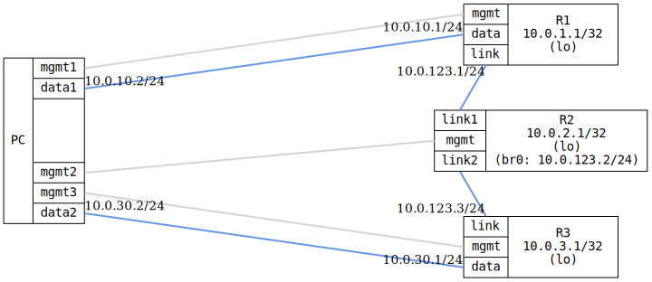

=== OSPF Point-to-Multipoint

ifdef::topdoc[:imagesdir: {topdoc}../../test/case/routing/ospf_point_to_multipoint]

==== Description

Verify OSPF point-to-multipoint (non-broadcast) interface type by
configuring three routers on a shared multi-access network with the
ietf-ospf 'point-to-multipoint' interface type and static neighbors.
This maps to FRR's 'point-to-multipoint non-broadcast' network type,
which requires manual neighbor configuration since there is no
multicast neighbor discovery.

R2 acts as the hub, bridging two physical links (link1, link2) into a
single broadcast domain (br0).  R1 and R3 each connect to one of R2's
ports.  The test verifies that all routers form OSPF adjacencies via
unicast, exchange routes, and that the interface type is correctly
reported as point-to-multipoint.

....
  +------------------+                                   +------------------+
  |       R1         |                                   |       R3         |
  |  10.0.1.1/32     |                                   |  10.0.3.1/32     |
  |     (lo)         |                                   |     (lo)         |
  +--------+---------+                                   +--------+---------+
           |  .1                                                  |  .3
           |               +------------------+                   |
           +----link1------+       R2         +------link2--------+
                           |  10.0.2.1/32     |
                           |     (lo)         |
                           | br0: 10.0.123.2  |
                           +------------------+
                              10.0.123.0/24
                      (P2MP non-broadcast / shared segment)
....

==== Topology

==== Sequence

. Set up topology and attach to target DUTs
. Configure targets
. Wait for OSPF routes
. Verify interface type is point-to-multipoint
. Verify connectivity between all DUTs

