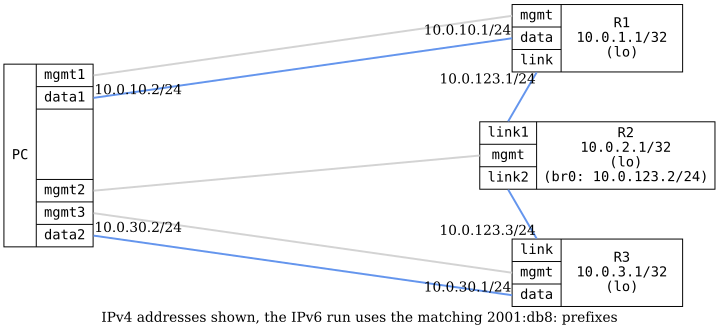

=== OSPFv3 Point-to-Multipoint Hybrid

ifdef::topdoc[:imagesdir: {topdoc}../../test/case/routing/ospf_point_to_multipoint_hybrid]

==== Description

Verify OSPFv3 point-to-multipoint hybrid (broadcast) interface type by
configuring three routers on a shared multi-access network with the
ietf-ospf 'hybrid' interface type.  This maps to the point-to-multipoint
network type using multicast for neighbor discovery.

R2 acts as the hub, bridging two physical links (link1, link2) into a
single broadcast domain (br0).  R1 and R3 each connect to one of R2's
ports.  The test verifies that all routers form OSPF adjacencies, exchange
routes, and that the interface type is correctly reported as hybrid.
....
     PC:data1                                              PC:data2
         |                                                     |
    +----+-----+                                          +----+-----+
    |    R1    |                                          |    R3    |
    |   (lo)   |                                          |   (lo)   |
    +----+-----+                                          +----+-----+
         | R1:link                                     R3:link |
         |            +------------------+                     |
         +--link1-----+        R2        +------link2----------+
                      |    (lo, br0)     |
                      +------------------+
                   shared segment, P2MP hybrid
....
The test is run once per address family, with the following addresses:

[cols="2,2,2",options="header"]
|===
|Node                 |IPv4            |IPv6
|R1 lo                |10.0.1.1/32     |2001:db8:1::1/128
|R2 lo                |10.0.2.1/32     |2001:db8:2::1/128
|R3 lo                |10.0.3.1/32     |2001:db8:3::1/128
|Shared segment       |10.0.123.0/24   |2001:db8:123::/64
|R1:data - PC:data1   |10.0.10.0/24    |2001:db8:10::/64
|R3:data - PC:data2   |10.0.30.0/24    |2001:db8:30::/64
|===

==== Topology

==== Sequence

. Set up topology and attach to target DUTs
. Configure targets
. Wait for OSPFv3 routes
. Verify interface type is hybrid
. Verify connectivity between all DUTs

