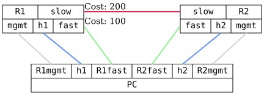

=== OSPFv3 BFD

ifdef::topdoc[:imagesdir: {topdoc}../../test/case/routing/ospfv3_bfd]

==== Description

Verify that a router running OSPFv3, with Bidirectional Forwarding Detection
(BFD) enabled, detects link faults over IPv6 even when the physical layer is
still operational.

This can typically happen when one logical link, from OSPF's perspective, is
made up of multiple physical links containing media converters without link
fault forwarding.

Note: OSPFv3 has no IPv4 address to derive a router-id from, so an
explicit-router-id is configured on every router.  OSPFv3 route next-hops are
IPv6 link-local addresses, so the active path is verified with traceroute
rather than by matching a RIB next-hop.

==== Topology

==== Sequence

. Set up topology and attach to target DUTs
. Setup TPMR between R1fast and R2fast
. Configure R1 and R2
. Setup IP addresses and default routes on h1 and h2
. Wait for R1 and R2 to peer
. Verify connectivity from PC:src to PC:dst via fast link
. Disable forwarding between R1fast and R2fast to trigger fail-over
. Verify connectivity from PC:src to PC:dst via slow link

