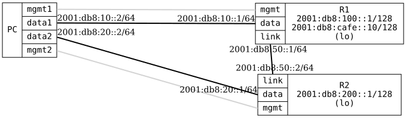

=== OSPFv3 Default Route Advertise

ifdef::topdoc[:imagesdir: {topdoc}../../test/case/routing/ospfv3_default_route_advertise]

==== Description

Verify _default-route-advertising_ in OSPFv3, sometimes called 'redistribute
origin'.  Verify both 'always' (regardless of whether a local default route
exists) and the conditional mode (only redistribute when a local default route
exists).

R1 has a default route (::/0) via its data interface and enables
default-route-advertise, so R2 learns a default route via OSPFv3.  When R1:data
is taken down the local default is withdrawn and R2 loses the default route,
unless 'always' is set.

Note: OSPFv3 has no IPv4 address to derive a router-id from, so an
explicit-router-id is configured on every router.

==== Topology

==== Sequence

. Set up topology and attach to target DUTs
. Configure targets
. Verify R2 has a default route and 2001:db8:100::1/128 from OSPFv3
. Verify connectivity from PC:data2 to 2001:db8:cafe::10
. Disable link PC:data1 <--> R1:data (take default gateway down)
. Verify R2 loses the default route but keeps 2001:db8:100::1/128 from OSPFv3
. Verify no connectivity from PC:data2 to 2001:db8:cafe::10
. Enable redistribute default route 'always' on R1
. Wait for all neighbors to peer
. Verify R2 has a default route and 2001:db8:100::1/128 from OSPFv3
. Verify connectivity from PC:data2 to 2001:db8:cafe::10

