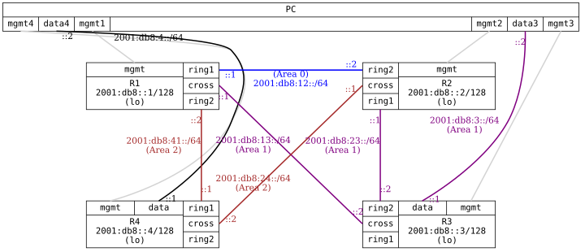

=== OSPFv3 with Multiple Areas

ifdef::topdoc[:imagesdir: {topdoc}../../test/case/routing/ospfv3_multiarea]

==== Description

Evaluates OSPFv3 across three areas (Area 0, Area 1 = NSSA, Area 2) over IPv6
to ensure deterministic (cost-based) route distribution.  It also verifies
broadcast vs point-to-point interface types on the transit links, explicit
router-id, and BFD-triggered fail-over on a link break.

Differences from the OSPFv2 multi-area test:
 - FRR ospf6d has no totally-NSSA (NSSA no-summary), so the "NSSA area sees
   only a default route" assertion is not mirrored; the area is a regular NSSA.
 - OSPFv3 route next-hops are IPv6 link-local addresses, so the data path is
   verified with traceroute (transit link global addresses) and reachability.
 - OSPFv3 has no IPv4 to derive a router-id from; explicit-router-id is set on
   every router.

....
                 2001:db8::1/32 (lo)
                        R1
        (Area0) 2001:db8:12::/64   R2
        (Area2) 2001:db8:41::/64   |  (Area1) 2001:db8:23::/64
        (Area1) 2001:db8:13::/64   |  (Area2) 2001:db8:24::/64
                        R4         R3
....

==== Topology

==== Sequence

. Set up topology and attach to target DUTs
. Configure targets
. Wait for all neighbors to peer
. Wait for cross-area OSPFv3 loopback routes
. Verify Area 0.0.0.1 on R3 is NSSA area
. Verify R1:ring2 is of type point-to-point
. Verify R4:ring1 is of type point-to-point
. Verify route to 2001:db8::3 from PC:data4 goes through 2001:db8:41::2 (R1)
. Break link R1:ring2 --- R4:ring1
. Verify route to 2001:db8::3 from PC:data4 fails over through 2001:db8:24::1 (R2)

