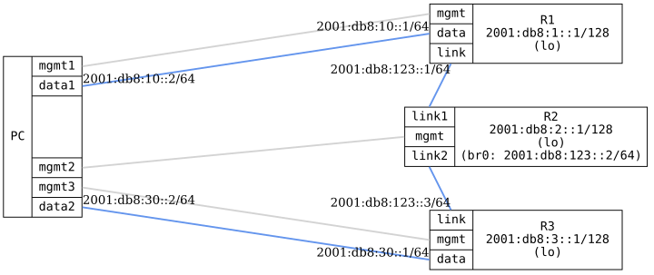

=== OSPFv3 Point-to-Multipoint Hybrid

ifdef::topdoc[:imagesdir: {topdoc}../../test/case/routing/ospfv3_point_to_multipoint_hybrid]

==== Description

Verify OSPFv3 point-to-multipoint hybrid interface type by configuring three
routers on a shared multi-access IPv6 network with the ietf-ospf 'hybrid'
interface type.  This maps to FRR ospf6d's 'point-to-multipoint' network type,
which uses multicast for neighbor discovery.

R2 acts as the hub, bridging two physical links (link1, link2) into a single
broadcast domain (br0).  R1 and R3 each connect to one of R2's ports.  The test
verifies that all routers form OSPFv3 adjacencies, exchange routes, and that
the interface type is reported as hybrid.

Note: OSPFv3 has no IPv4 address to derive a router-id from, so an
explicit-router-id is configured on every router.

==== Topology

==== Sequence

. Set up topology and attach to target DUTs
. Configure targets
. Wait for OSPFv3 routes
. Verify interface type is hybrid
. Verify connectivity between all DUTs

