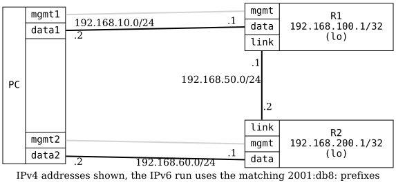

=== RIPv2 Basic

ifdef::topdoc[:imagesdir: {topdoc}../../test/case/routing/rip_basic]

==== Description

Verifies basic RIPv2 functionality by configuring two routers (R1 and R2)
with RIPv2 on their interconnecting link.  The test ensures routes are
exchanged between the routers and end-to-end connectivity is achieved.

The test PC uses data1 interface to connect to R1's data port, and data2
interface to connect to R2's data port (which does not have RIPv2 enabled).
This verifies that RIP status information remains accessible when a router
has non-RIPv2 interfaces.

==== Topology

==== Sequence

. Set up topology and attach to target DUTs
. Configure targets
. Wait for RIPv2 routes to be exchanged
. Test connectivity from PC:data1 to R2 loopback via RIPv2
. Test connectivity from PC:data2 to R1 loopback via RIPv2

