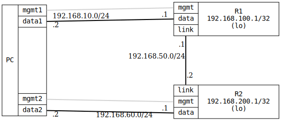

=== RIP Basic

ifdef::topdoc[:imagesdir: {topdoc}../../test/case/routing/rip_basic]

==== Description

Verifies basic RIP functionality by configuring two routers (R1 and R2)
with RIP on their interconnecting link.  The test ensures RIP routes are
exchanged between the routers and end-to-end connectivity is achieved.

The test PC uses data1 interface to connect to R1's data port, and data2
interface to connect to R2's data port (which does not have RIP enabled).
This verifies that RIP status information remains accessible when a router
has non-RIP interfaces.

==== Topology

==== Sequence

. Set up topology and attach to target DUTs
. Configure targets
. Wait for RIP routes to be exchanged
. Test connectivity from PC:data1 to R2 loopback via RIP
. Test connectivity from PC:data2 to R1 loopback via RIP

