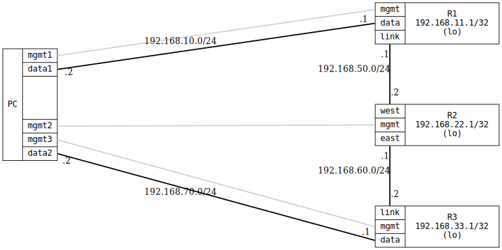

=== RIP Multi-hop

ifdef::topdoc[:imagesdir: {topdoc}../../test/case/routing/rip_multihop]

==== Description

Verifies RIP functionality across multiple hops with three routers in a line
topology (R1 -- R2 -- R3). This test ensures:
- RIP routes propagate through multiple hops
- R2 (middle router) has two RIP neighbors
- End-to-end connectivity works across the RIP network

Topology:
  PC:data1 -- R1 -- R2 -- R3 -- PC:data2

==== Topology

==== Sequence

. Set up topology and attach to target DUTs
. Configure routers
. Wait for RIP routes to be exchanged
. Verify R2 has two RIP neighbors
. Test end-to-end connectivity PC:data1 to R3 loopback
. Test end-to-end connectivity PC:data2 to R1 loopback

